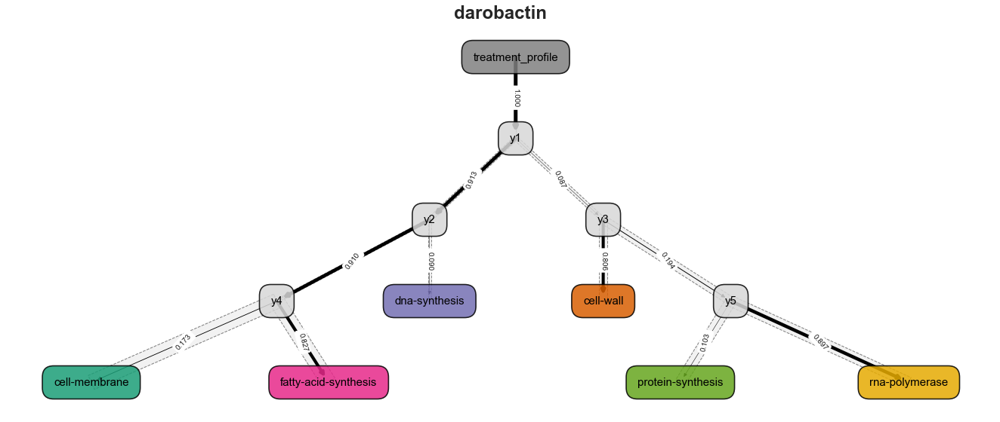

 </img> 
# Predicting antimicrobial mechanism-of-action from transcriptomes: A generalizable explainable artificial intelligence approach

### Josh L. Espinoza\*, Chris L. Dupont\*, Aubrie O’Rourke, Sinem Beyhan, Pavel Morales, Amy Spoering, Kirsten J. Meyer, Agnes P. Chan, Yongwook Choi, William C. Nierman, Kim Lewis, Karen E. Nelson
_______________________

The following traverses the methods associated with *Espinoza, Dupont et al. 2021*.  
In particular, this is designed to showcase the usage of the *Soothsayer* Python 3 packages, *Clairvoyance* executable for feature-selection, building/training/evaluating HEC graphical models, and advanced plotting methods.


### Tables of Contents:
_______________________
 * I. Training and testing datasets
 * II. Determine hierarchical topology for HEC graphical models
 * III. Partition sub-model training data for *Clairvoyance* feature selection on compute server
 * IV. Selecting gene-set and hyperparameter configurations for each sub-model
 * V. Architecture and construction of HEC graphical models for MOA prediction
 * VI. Evaluating model performance at various hierarchies
 * VII. Generating relevant figures using *Soothsayer*, *matplotlib*, *seaborn*, and *networkx*


### Relevant information: 

* *[Soothsayer](https://github.com/jolespin/soothsayer)*
* [P01AI118687](http://grantome.com/grant/NIH/P01-AI118687-03)
* [PRJNA532938](https://www.ncbi.nlm.nih.gov/bioproject/?term=PRJNA532938)
* [Publication](https://journals.plos.org/ploscompbiol/article?id=10.1371/journal.pcbi.1008857)

 </img> 


```python
# Get dataset
!git clone https://github.com/jolespin/antimicrobial_resistance_modeling
```

    Cloning into 'antimicrobial_resistance_modeling'...
    remote: Enumerating objects: 1184, done.
    remote: Total 1184 (delta 0), reused 0 (delta 0), pack-reused 1184
    Receiving objects: 100% (1184/1184), 669.76 MiB | 9.72 MiB/s, done.
    Resolving deltas: 100% (307/307), done.
    Checking out files: 100% (991/991), done.


```python
# Duration
primordial = time.time()

# Packages
import sys,os,glob
from collections import defaultdict, OrderedDict
import numpy as np
from scipy import stats
import pandas as pd
import networkx as nx
import seaborn as sns
import matplotlib.pyplot as plt
from mpl_toolkits.axes_grid1 import make_axes_locatable
from palettable.cmocean.diverging import *
from palettable.cartocolors.diverging import *
from tqdm import tqdm
from sklearn.linear_model import LogisticRegression
from sklearn.tree import DecisionTreeClassifier

# Soothsayer
import soothsayer as sy
from soothsayer.classification import HierarchicalClassifier as HEC
from soothsayer.transmute.normalization import *
from soothsayer.transmute.conversion import *

# Credentials
print("Author: {}\nSoothsayer version: {}\nGitHub URL: {}\nContact: {}".format(sy.__author__, sy.__version__, sy.__url__, sy.utils.consecutive_replace(sy.__email__, ("@","[at]"), (".", "[dot]"))), file=sys.stdout)

%matplotlib inline
```

    Author: Josh L. Espinoza
    Soothsayer version: 2020.07.28
    GitHub URL: https://github.com/jolespin/soothsayer
    Contact: jespinoz[at]jcvi[dot]org, jol[dot]espinoz[at]gmail[dot]com


    Soothsayer_v2020.07.28 | 00:00:00


# I. Training and testing datasets


```python
# ============
# Version info
# ============
query_model = "model_v7.0"
version_model = query_model.split("_")[-1]

# =============
# Load gene metadata
# =============
df_meta_genes = sy.io.read_dataframe("../Data/metadata/metadata__ecogenes.tsv.gz")

# ==================
# Load pairwise log2fc
# ==================

# Training data
ds_training = sy.Dataset(data=sy.io.read_dataframe("../Data/profiles/X__training.tsv.gz", index_col=[0,1]),
                           metadata_observations=sy.io.read_dataframe("../Data/metadata/metadata__training.tsv.gz",index_col=[0,1]),
                           metadata_attributes=df_meta_genes,
                           metadata_target_field="moa",
                           obsv_type="pwlog2fc",
                           attr_type="gene",
                           metric_type="pairwise log2fc profiles",
                           name="training",
                           check_index_overlap=False,
)

# Kirromycin
ds_kirromycin = sy.Dataset(data=sy.io.read_dataframe("../Data/profiles/X__kirromycin.tsv.gz",index_col=[0,1]),
                           metadata_observations=sy.io.read_dataframe("../Data/metadata/metadata__kirromycin.tsv.gz",index_col=[0,1]),
                           metadata_attributes=df_meta_genes,
                           obsv_type="pwlog2fc",
                           attr_type="gene",
                           metric_type="pairwise log2fc profiles",
                           name="kirromycin",
                           check_index_overlap=False,
)
# Darobactin
ds_darobactin = sy.Dataset(data=sy.io.read_dataframe("../Data/profiles/X__darobactin.tsv.gz", index_col=[0,1]),
                           metadata_observations=sy.io.read_dataframe("../Data/metadata/metadata__darobactin.tsv.gz",index_col=[0,1]),
                           metadata_attributes=df_meta_genes,
                           obsv_type="pwlog2fc",
                           attr_type="gene",
                           metric_type="pairwise log2fc profiles",
                           name="darobactin",
                           check_index_overlap=False,
)

# =======
# Utility
# =======

# CPD -> MOA
d_cpd_moa = {
    **dict(ds_training.metadata_observations.loc[:,["cpd_local","moa"]].values), 
    **dict(ds_training.metadata_observations.loc[:,["cpd_universal","moa"]].values)
} 
d_cpd_moa["darobactin"] = "darobactin"
d_cpd_moa["kirromycin"] = "protein-synthesis"

# Does cpd have producer or not? (Used for cross-validation)
d_cpd_hasproducer = dict()
for cpd, df in ds_training.metadata_observations.loc[:,["cpd_local", "sample-category"]].groupby("cpd_local", axis=0):
    d_cpd_hasproducer[cpd] = set(df["sample-category"].unique()) == {'pure_compound', 'producer_strain'}
    
# ======
# Colors
# ======
# MOA
colors = sns.color_palette(palette="Dark2", n_colors=6).as_hex()
d_moa_color = dict(zip(sorted(['protein-synthesis', 'rna-polymerase', 'cell-wall', 'cell-membrane', 'dna-synthesis', 'fatty-acid-synthesis']), colors)) 
d_moa_color["darobactin"] = "black"

sns.palplot(colors) # 6

# Diverging
palette_diverging = TealRose_7_r
cmap_diverging = palette_diverging.mpl_colormap
colors_diverging = palette_diverging.mpl_colors
color_positive = colors_diverging[-1] 
color_negative = colors_diverging[0]
sns.palplot(colors_diverging) # 7

# Sequential
cmap_sequential = plt.cm.magma_r
sns.palplot(np.asarray(cmap_sequential.colors)[np.linspace(0,len(cmap_sequential.colors)-1,8).astype(int)]) # 8
```


# II. Determine hierarchical topology for HEC graphical models


```python
# ====================================
# Determine topology for training data
# ====================================
# Get training data
X_training = ds_training.X
y_training = ds_training.y

# Hierarchical Topology
topology_training = sy.Topology(
    X=X_training, 
    y=y_training, 
    name=query_model, 
    class_type="moa", 
    attr_type="gene", 
    obsv_type="pwlog2fc", 
    class_colors=d_moa_color, 
    verbose=False,
)
# Get the target matrix which walks through the paths in the graph
Y_training = topology_training.get_target_matrix()
# Get the root sub-model which we will use for manual cross-validation later
root_submodel = topology_training.submodels[0] # y1 
# View the topology
print(sy.utils.format_header("HEC Model Topology:"), topology_training.get_ascii(), sep="\n")
```

    ===================
    HEC Model Topology:
    ===================
    
             /-fatty-acid-synthesis
          /y4
       /y2   \-cell-membrane
      |  |
      |   \-dna-synthesis
    -y1
      |      /-rna-polymerase
      |   /y5
       \y3   \-protein-synthesis
         |
          \-cell-wall


    Inferred association as `dissimilarity`


# III. Partition sub-model training data for *Clairvoyance* feature selection on compute server


```python
# =================================
# Partition sub-model training data
# =================================
# Get compound-specific cross-validation pairs
def get_compound_specific_cross_validation_pairs(index:pd.Index, y:pd.Series):
    """
    If you don't have producer strains, then use this...
    index: pd.Index of X (attribute matrix)
    y: pd.Series of key=id matching X.index and value=cpd label
    """
    cross_validation_pairs = defaultdict(dict)
    for i, cpd in enumerate(y.unique()):
        idx_te = y[index].reset_index(drop=True).compress(lambda x: x == cpd).index.tolist()
        idx_tr = list(set([*range(len(y))]) - set(idx_te))
        cross_validation_pairs[cpd]["Training"] = idx_tr
        cross_validation_pairs[cpd]["Testing"] = idx_te
    return pd.DataFrame(cross_validation_pairs).T.loc[:,["Training", "Testing"]]

# Get compound-specific producer-strain-aware cross-validation pairs
def get_compound_specific_cross_validation_pairs_with_producers(index:pd.Index, y_cpd__produceragnostic:pd.Series, y_cpd__produceraware:pd.Series, d_cpd_hasproducer=d_cpd_hasproducer):
    """
    If you do have producer strains and want to similulate different observation types, then use this...
    index: pd.Index of X (attribute matrix)
    y_cpd__produceragnostic: pd.Series of key=id matching X.index and value=cpd label
    y_cpd__produceraware: pd.Series of key=id matching X.index and value=cpd label with producer-strain information
    """
    assert set(y_cpd__produceragnostic.index) == set(y_cpd__produceraware.index), "Sets must be identitical"
    cross_validation_pairs = defaultdict(dict)
    for i, cpd in enumerate(y_cpd__produceragnostic.unique()):
        if  d_cpd_hasproducer[cpd] == False:
            idx_te = y_cpd__produceragnostic[index].reset_index(drop=True)[lambda x: x == cpd].index.tolist()
            idx_tr = list(set([*range(len(y_cpd__produceragnostic))]) - set(idx_te))
            cross_validation_pairs[cpd]["Training"] = idx_tr
            cross_validation_pairs[cpd]["Testing"] = idx_te
        else:
            # Producer-strain (seen pure)
            idx_te_producer = y_cpd__produceraware[index].reset_index(drop=True)[lambda x: x == f"{cpd}_producer-strain"].index.tolist()
            idx_tr = list(set([*range(len(y_cpd__produceraware))]) - set(idx_te_producer))
            cross_validation_pairs[f"{cpd}_producer-strain_seen-pure"]["Training"] = idx_tr
            cross_validation_pairs[f"{cpd}_producer-strain_seen-pure"]["Testing"] = idx_te_producer
            # Producer-strain (unseen pure)
            idx_te_producer = y_cpd__produceraware[index].reset_index(drop=True)[lambda x: x == f"{cpd}_producer-strain"].index.tolist()
            idx_te_pure = y_cpd__produceraware[index].reset_index(drop=True)[lambda x: x == cpd].index.tolist()
            idx_tr = list(set([*range(len(y_cpd__produceraware))]) - set(idx_te_producer) - set(idx_te_pure))
            cross_validation_pairs[f"{cpd}_producer-strain_unseen-pure"]["Training"] = idx_tr
            cross_validation_pairs[f"{cpd}_producer-strain_unseen-pure"]["Testing"] = idx_te_producer
            # Pure
            idx_te = y_cpd__produceraware[index].reset_index(drop=True)[lambda x: x == cpd].index.tolist()
            idx_tr = list(set([*range(len(y_cpd__produceraware))]) - set(idx_te))
            cross_validation_pairs[cpd]["Training"] = idx_tr
            cross_validation_pairs[cpd]["Testing"] = list(set(idx_te) - set(idx_te_producer))
    return pd.DataFrame(cross_validation_pairs).T.loc[:,["Training", "Testing"]]

# =========================================================
# Write X, y, and cross-validation pairs for each sub-model
# =========================================================

for submodel, y_submodel in tqdm(Y_training.T.iterrows(), "Partitioning sub-model training data and cross-validation pairs"):
    # Create directory for each sub-model
    os.makedirs(f"../Data/model/sub-models/{submodel}", exist_ok=True)

    # Get the target vector for the current sub-model
    y_submodel = y_submodel.copy().dropna() # Probably don't need to copy...just being safe
    
    # Get the relevant samples and subset the global attribute matrix 
    X_submodel = X_training.loc[y_submodel.index,:]
    
    # Get the compound-specific producer-strain-aware cross-validation pairs
    cv_submodel = get_compound_specific_cross_validation_pairs_with_producers(
        index=X_submodel.index, 
        y_cpd__produceragnostic=ds_training.metadata_observations.loc[X_submodel.index,"cpd_local"],
        y_cpd__produceraware=ds_training.metadata_observations.loc[X_submodel.index,"cpd_local-producer"]
    )
    X_testing = sy.io.read_dataframe(f"../Data/model/sub-models/{submodel}/X.pbz2")
    y_testing = sy.io.read_dataframe(f"../Data/model/sub-models/{submodel}/y.pbz2").iloc[:,0]
    cv_testing = sy.io.read_dataframe(f"../Data/model/sub-models/{submodel}/cv.tsv")
    
    # Write files
#     sy.io.write_dataframe(X_submodel, f"../Data/model/sub-models/{submodel}/X.pkl") # This is a wrapper on pandas.  It just interprets the ending to write the correct file.  Defaults to .tsv b/c let's be honest...tsv just make more sense than csv.
#     sy.io.write_dataframe(y_submodel.to_frame(), f"../Data/model/sub-models/{submodel}/y.pkl")
#     sy.io.write_dataframe(cv_submodel, f"../Data/model/sub-models/{submodel}/cv.tsv") # The custom cv has to be either an integer, None, or a path to a .tsv (not a pickled pd.DataFrame) for Clairvoyance...for now.

```

    Partitioning sub-model training data and cross-validation pairs: 5it [00:04,  1.06it/s]


## Running *Clairvoyance* feature selection

We chose to run a very bruteforce-style approach on our compute server to identify multiple "best" candidates.  
This can be run relatively quickly using the default settings on a laptop.  

#### *Clairvoyance* command for sub-model `y1`
```bash
source activate soothsayer_env
VERSION="v7.0"
SUBMODEL="y1" # The same command was run for all sub-models
NAME="${VERSION}_${SUBMODEL}"
run_soothsayer.py clairvoyance \
                -X ./${SUBMODEL}/X.pbz2 \
                -y ./${SUBMODEL}/y.pbz2 \
                --cv ./${SUBMODEL}/cv.tsv \
                --model_type logistic,tree \
                --n_iter 500 \
                --name ${NAME} \
                --min_threshold None,0.0,0.1,0.2,0.3,0.4,0.5,0.6,0.7,0.8,0.9 \
                --percentiles 0.0,0.1,0.2,0.3,0.4,0.5,0.6,0.7,0.8,0.9,0.91,0.92,0.93,0.94,0.95,0.96,0.97,0.98,0.99 \
                --method bruteforce  \
                --early_stopping 100 \
                --out_dir ${SUBMODEL} \
                --attr_type gene \
                --class_type moa \
                --n_jobs 16 \
                --save_model False
```

#### This is how we set up our directory for this study, you can do it differently if you want: 

Attribute matrix `X`, the target vector `y`, and, if desired, custom cross-validation pairs `cv.tsv`. 

`X` or `y` can be a `.tsv`, `.pkl`, `.pgz`, or `.pbz2` where `.pkl` is a Python `pickle` {`pd.DataFrame` or `pd.Series`}, `.pgz` is a gzipped `pickle`, and `.pbz2` is bz2 compress `pickle`

```
y1/
├── cv.tsv
├── X.pbz2
└── y.pbz2
```

#### After running *Clairvoyance*, the most useful files are in `${OUT_DIR}/${NAME}__synopsis`

We had several "best" candidates so we went through the different gene-set/hyperparameter configurations to choose the models w/ the lowest SEM:

<details><summary>  <font size="+1"> <i>Clairvoyance</i> output from sub-model `y1` </font></summary>
<p>


```python
y1/
├── cv.tsv
├── logistic/
│   ├── percentile_0.0/
│   │   ├── acu.tsv.gz
│   │   ├── hyperparameters.tsv.gz
│   │   ├── kernel.nc
│   │   ├── min_threshold_0.0/
│   │   │   ├── model-data.pbz2
│   │   │   ├── scores.png
│   │   │   ├── scores.tsv.gz
│   │   │   └── weights.tsv.gz
│   │   ├── min_threshold_0.9/
│   │   │   ├── scores.png
│   │   │   ├── scores.tsv.gz
│   │   │   └── weights.tsv.gz
│   │   ├── min_threshold_None/
│   │   │   ├── scores.png
│   │   │   ├── scores.tsv.gz
│   │   │   └── weights.tsv.gz
│   │   ├── summary.txt
│   │   ├── weights.png
│   │   └── weights.tsv.gz
│   ├── percentile_0.1/
│   │   ├── acu.tsv.gz
│   │   ├── hyperparameters.tsv.gz
│   │   ├── kernel.nc
│   │   ├── min_threshold_0.0/
│   │   │   ├── scores.png
│   │   │   ├── scores.tsv.gz
│   │   │   └── weights.tsv.gz
│   │   ├── min_threshold_0.9/
│   │   │   ├── scores.png
│   │   │   ├── scores.tsv.gz
│   │   │   └── weights.tsv.gz
│   │   ├── min_threshold_None/
│   │   │   ├── scores.png
│   │   │   ├── scores.tsv.gz
│   │   │   └── weights.tsv.gz
│   │   ├── summary.txt
│   │   ├── weights.png
│   │   ├── weights.tsv.gz
│   │   └── X.subset.pbz2
│   ├── percentile_0.2/
│   │   ├── acu.tsv.gz
│   │   ├── hyperparameters.tsv.gz
│   │   ├── kernel.nc
│   │   ├── min_threshold_0.0/
│   │   │   ├── model-data.pbz2
│   │   │   ├── scores.png
│   │   │   ├── scores.tsv.gz
│   │   │   └── weights.tsv.gz
│   │   ├── min_threshold_0.9/
│   │   │   ├── scores.png
│   │   │   ├── scores.tsv.gz
│   │   │   └── weights.tsv.gz
│   │   ├── min_threshold_None/
│   │   │   ├── scores.png
│   │   │   ├── scores.tsv.gz
│   │   │   └── weights.tsv.gz
│   │   ├── summary.txt
│   │   ├── weights.png
│   │   ├── weights.tsv.gz
│   │   └── X.subset.pbz2
│   ├── percentile_0.3/
│   │   ├── acu.tsv.gz
│   │   ├── hyperparameters.tsv.gz
│   │   ├── kernel.nc
│   │   ├── min_threshold_0.0/
│   │   │   ├── model-data.pbz2
│   │   │   ├── scores.png
│   │   │   ├── scores.tsv.gz
│   │   │   └── weights.tsv.gz
│   │   ├── min_threshold_0.9/
│   │   │   ├── scores.png
│   │   │   ├── scores.tsv.gz
│   │   │   └── weights.tsv.gz
│   │   ├── min_threshold_None/
│   │   │   ├── scores.png
│   │   │   ├── scores.tsv.gz
│   │   │   └── weights.tsv.gz
│   │   ├── summary.txt
│   │   ├── weights.png
│   │   ├── weights.tsv.gz
│   │   └── X.subset.pbz2
│   ├── percentile_0.4/
│   │   ├── acu.tsv.gz
│   │   ├── hyperparameters.tsv.gz
│   │   ├── kernel.nc
│   │   ├── min_threshold_0.0/
│   │   │   ├── scores.png
│   │   │   ├── scores.tsv.gz
│   │   │   └── weights.tsv.gz
│   │   ├── min_threshold_0.9/
│   │   │   ├── scores.png
│   │   │   ├── scores.tsv.gz
│   │   │   └── weights.tsv.gz
│   │   ├── min_threshold_None/
│   │   │   ├── scores.png
│   │   │   ├── scores.tsv.gz
│   │   │   └── weights.tsv.gz
│   │   ├── summary.txt
│   │   ├── weights.png
│   │   ├── weights.tsv.gz
│   │   └── X.subset.pbz2
│   ├── percentile_0.5/
│   │   ├── acu.tsv.gz
│   │   ├── hyperparameters.tsv.gz
│   │   ├── kernel.nc
│   │   ├── min_threshold_0.0/
│   │   │   ├── scores.png
│   │   │   ├── scores.tsv.gz
│   │   │   └── weights.tsv.gz
│   │   ├── min_threshold_0.9/
│   │   │   ├── scores.png
│   │   │   ├── scores.tsv.gz
│   │   │   └── weights.tsv.gz
│   │   ├── min_threshold_None/
│   │   │   ├── scores.png
│   │   │   ├── scores.tsv.gz
│   │   │   └── weights.tsv.gz
│   │   ├── summary.txt
│   │   ├── weights.png
│   │   ├── weights.tsv.gz
│   │   └── X.subset.pbz2
│   ├── percentile_0.6/
│   │   ├── acu.tsv.gz
│   │   ├── hyperparameters.tsv.gz
│   │   ├── kernel.nc
│   │   ├── min_threshold_0.0/
│   │   │   ├── scores.png
│   │   │   ├── scores.tsv.gz
│   │   │   └── weights.tsv.gz
│   │   ├── min_threshold_0.9/
│   │   │   ├── scores.png
│   │   │   ├── scores.tsv.gz
│   │   │   └── weights.tsv.gz
│   │   ├── min_threshold_None/
│   │   │   ├── scores.png
│   │   │   ├── scores.tsv.gz
│   │   │   └── weights.tsv.gz
│   │   ├── summary.txt
│   │   ├── weights.png
│   │   ├── weights.tsv.gz
│   │   └── X.subset.pbz2
│   ├── percentile_0.7/
│   │   ├── acu.tsv.gz
│   │   ├── hyperparameters.tsv.gz
│   │   ├── kernel.nc
│   │   ├── min_threshold_0.0/
│   │   │   ├── scores.png
│   │   │   ├── scores.tsv.gz
│   │   │   └── weights.tsv.gz
│   │   ├── min_threshold_0.9/
│   │   │   ├── scores.png
│   │   │   ├── scores.tsv.gz
│   │   │   └── weights.tsv.gz
│   │   ├── min_threshold_None/
│   │   │   ├── scores.png
│   │   │   ├── scores.tsv.gz
│   │   │   └── weights.tsv.gz
│   │   ├── summary.txt
│   │   ├── weights.png
│   │   ├── weights.tsv.gz
│   │   └── X.subset.pbz2
│   ├── percentile_0.8/
│   │   ├── acu.tsv.gz
│   │   ├── hyperparameters.tsv.gz
│   │   ├── kernel.nc
│   │   ├── min_threshold_0.0/
│   │   │   ├── scores.png
│   │   │   ├── scores.tsv.gz
│   │   │   └── weights.tsv.gz
│   │   ├── min_threshold_0.9/
│   │   │   ├── scores.png
│   │   │   ├── scores.tsv.gz
│   │   │   └── weights.tsv.gz
│   │   ├── min_threshold_None/
│   │   │   ├── scores.png
│   │   │   ├── scores.tsv.gz
│   │   │   └── weights.tsv.gz
│   │   ├── summary.txt
│   │   ├── weights.png
│   │   ├── weights.tsv.gz
│   │   └── X.subset.pbz2
│   ├── percentile_0.9/
│   │   ├── acu.tsv.gz
│   │   ├── hyperparameters.tsv.gz
│   │   ├── kernel.nc
│   │   ├── min_threshold_0.0/
│   │   │   ├── scores.png
│   │   │   ├── scores.tsv.gz
│   │   │   └── weights.tsv.gz
│   │   ├── min_threshold_0.9/
│   │   │   ├── scores.png
│   │   │   ├── scores.tsv.gz
│   │   │   └── weights.tsv.gz
│   │   ├── min_threshold_None/
│   │   │   ├── scores.png
│   │   │   ├── scores.tsv.gz
│   │   │   └── weights.tsv.gz
│   │   ├── summary.txt
│   │   ├── weights.png
│   │   ├── weights.tsv.gz
│   │   └── X.subset.pbz2
│   ├── percentile_0.91/
│   │   ├── acu.tsv.gz
│   │   ├── hyperparameters.tsv.gz
│   │   ├── kernel.nc
│   │   ├── min_threshold_0.0/
│   │   │   ├── scores.png
│   │   │   ├── scores.tsv.gz
│   │   │   └── weights.tsv.gz
│   │   ├── min_threshold_0.9/
│   │   │   ├── scores.png
│   │   │   ├── scores.tsv.gz
│   │   │   └── weights.tsv.gz
│   │   ├── min_threshold_None/
│   │   │   ├── scores.png
│   │   │   ├── scores.tsv.gz
│   │   │   └── weights.tsv.gz
│   │   ├── summary.txt
│   │   ├── weights.png
│   │   ├── weights.tsv.gz
│   │   └── X.subset.pbz2
│   ├── percentile_0.92/
│   │   ├── acu.tsv.gz
│   │   ├── hyperparameters.tsv.gz
│   │   ├── kernel.nc
│   │   ├── min_threshold_0.0/
│   │   │   ├── scores.png
│   │   │   ├── scores.tsv.gz
│   │   │   └── weights.tsv.gz
│   │   ├── min_threshold_0.9/
│   │   │   ├── scores.png
│   │   │   ├── scores.tsv.gz
│   │   │   └── weights.tsv.gz
│   │   ├── min_threshold_None/
│   │   │   ├── scores.png
│   │   │   ├── scores.tsv.gz
│   │   │   └── weights.tsv.gz
│   │   ├── summary.txt
│   │   ├── weights.png
│   │   ├── weights.tsv.gz
│   │   └── X.subset.pbz2
│   ├── percentile_0.93/
│   │   ├── acu.tsv.gz
│   │   ├── hyperparameters.tsv.gz
│   │   ├── kernel.nc
│   │   ├── min_threshold_0.0/
│   │   │   ├── scores.png
│   │   │   ├── scores.tsv.gz
│   │   │   └── weights.tsv.gz
│   │   ├── min_threshold_0.9/
│   │   │   ├── scores.png
│   │   │   ├── scores.tsv.gz
│   │   │   └── weights.tsv.gz
│   │   ├── min_threshold_None/
│   │   │   ├── scores.png
│   │   │   ├── scores.tsv.gz
│   │   │   └── weights.tsv.gz
│   │   ├── summary.txt
│   │   ├── weights.png
│   │   ├── weights.tsv.gz
│   │   └── X.subset.pbz2
│   ├── percentile_0.94/
│   │   ├── acu.tsv.gz
│   │   ├── hyperparameters.tsv.gz
│   │   ├── kernel.nc
│   │   ├── min_threshold_0.0/
│   │   │   ├── model-data.pbz2
│   │   │   ├── scores.png
│   │   │   ├── scores.tsv.gz
│   │   │   └── weights.tsv.gz
│   │   ├── min_threshold_0.9/
│   │   │   ├── scores.png
│   │   │   ├── scores.tsv.gz
│   │   │   └── weights.tsv.gz
│   │   ├── min_threshold_None/
│   │   │   ├── scores.png
│   │   │   ├── scores.tsv.gz
│   │   │   └── weights.tsv.gz
│   │   ├── summary.txt
│   │   ├── weights.png
│   │   ├── weights.tsv.gz
│   │   └── X.subset.pbz2
│   ├── percentile_0.95/
│   │   ├── acu.tsv.gz
│   │   ├── hyperparameters.tsv.gz
│   │   ├── kernel.nc
│   │   ├── min_threshold_0.0/
│   │   │   ├── scores.png
│   │   │   ├── scores.tsv.gz
│   │   │   └── weights.tsv.gz
│   │   ├── min_threshold_0.9/
│   │   │   ├── scores.png
│   │   │   ├── scores.tsv.gz
│   │   │   └── weights.tsv.gz
│   │   ├── min_threshold_None/
│   │   │   ├── scores.png
│   │   │   ├── scores.tsv.gz
│   │   │   └── weights.tsv.gz
│   │   ├── summary.txt
│   │   ├── weights.png
│   │   ├── weights.tsv.gz
│   │   └── X.subset.pbz2
│   ├── percentile_0.96/
│   │   ├── acu.tsv.gz
│   │   ├── hyperparameters.tsv.gz
│   │   ├── kernel.nc
│   │   ├── min_threshold_0.0/
│   │   │   ├── model-data.pbz2
│   │   │   ├── scores.png
│   │   │   ├── scores.tsv.gz
│   │   │   └── weights.tsv.gz
│   │   ├── min_threshold_0.9/
│   │   │   ├── scores.png
│   │   │   ├── scores.tsv.gz
│   │   │   └── weights.tsv.gz
│   │   ├── min_threshold_None/
│   │   │   ├── scores.png
│   │   │   ├── scores.tsv.gz
│   │   │   └── weights.tsv.gz
│   │   ├── summary.txt
│   │   ├── weights.png
│   │   ├── weights.tsv.gz
│   │   └── X.subset.pbz2
│   ├── percentile_0.97/
│   │   ├── acu.tsv.gz
│   │   ├── hyperparameters.tsv.gz
│   │   ├── kernel.nc
│   │   ├── min_threshold_0.0/
│   │   │   ├── scores.png
│   │   │   ├── scores.tsv.gz
│   │   │   └── weights.tsv.gz
│   │   ├── summary.txt
│   │   ├── weights.png
│   │   ├── weights.tsv.gz
│   │   └── X.subset.pbz2
│   ├── percentile_0.98/
│   │   ├── acu.tsv.gz
│   │   ├── hyperparameters.tsv.gz
│   │   ├── kernel.nc
│   │   ├── min_threshold_0.0/
│   │   │   ├── scores.png
│   │   │   ├── scores.tsv.gz
│   │   │   └── weights.tsv.gz
│   │   ├── summary.txt
│   │   ├── weights.png
│   │   ├── weights.tsv.gz
│   │   └── X.subset.pbz2
│   └── percentile_0.99/
│       ├── acu.tsv.gz
│       ├── hyperparameters.tsv.gz
│       ├── kernel.nc
│       ├── min_threshold_0.0/
│       │   ├── scores.png
│       │   ├── scores.tsv.gz
│       │   └── weights.tsv.gz
│       ├── summary.txt
│       ├── weights.png
│       ├── weights.tsv.gz
│       └── X.subset.pbz2
├── tree/
│   ├── percentile_0.0/
│   │   ├── acu.tsv.gz
│   │   ├── hyperparameters.tsv.gz
│   │   ├── kernel.nc
│   │   ├── min_threshold_0.0/
│   │   │   ├── model-data.pbz2
│   │   │   ├── scores.png
│   │   │   ├── scores.tsv.gz
│   │   │   └── weights.tsv.gz
│   │   ├── summary.txt
│   │   ├── weights.png
│   │   └── weights.tsv.gz
│   ├── percentile_0.1/
│   │   ├── acu.tsv.gz
│   │   ├── hyperparameters.tsv.gz
│   │   ├── kernel.nc
│   │   ├── min_threshold_0.0/
│   │   │   ├── model-data.pbz2
│   │   │   ├── scores.png
│   │   │   ├── scores.tsv.gz
│   │   │   └── weights.tsv.gz
│   │   ├── summary.txt
│   │   ├── weights.png
│   │   ├── weights.tsv.gz
│   │   └── X.subset.pbz2
│   ├── percentile_0.2/
│   │   ├── acu.tsv.gz
│   │   ├── hyperparameters.tsv.gz
│   │   ├── kernel.nc
│   │   ├── min_threshold_0.0/
│   │   │   ├── scores.png
│   │   │   ├── scores.tsv.gz
│   │   │   └── weights.tsv.gz
│   │   ├── summary.txt
│   │   ├── weights.png
│   │   ├── weights.tsv.gz
│   │   └── X.subset.pbz2
│   ├── percentile_0.3/
│   │   ├── acu.tsv.gz
│   │   ├── hyperparameters.tsv.gz
│   │   ├── kernel.nc
│   │   ├── min_threshold_0.0/
│   │   │   ├── scores.png
│   │   │   ├── scores.tsv.gz
│   │   │   └── weights.tsv.gz
│   │   ├── summary.txt
│   │   ├── weights.png
│   │   ├── weights.tsv.gz
│   │   └── X.subset.pbz2
│   ├── percentile_0.4/
│   │   ├── acu.tsv.gz
│   │   ├── hyperparameters.tsv.gz
│   │   ├── kernel.nc
│   │   ├── min_threshold_0.0/
│   │   │   ├── scores.png
│   │   │   ├── scores.tsv.gz
│   │   │   └── weights.tsv.gz
│   │   ├── summary.txt
│   │   ├── weights.png
│   │   ├── weights.tsv.gz
│   │   └── X.subset.pbz2
│   ├── percentile_0.5/
│   │   ├── acu.tsv.gz
│   │   ├── hyperparameters.tsv.gz
│   │   ├── kernel.nc
│   │   ├── min_threshold_0.0/
│   │   │   ├── model-data.pbz2
│   │   │   ├── scores.png
│   │   │   ├── scores.tsv.gz
│   │   │   └── weights.tsv.gz
│   │   ├── summary.txt
│   │   ├── weights.png
│   │   ├── weights.tsv.gz
│   │   └── X.subset.pbz2
│   ├── percentile_0.6/
│   │   ├── acu.tsv.gz
│   │   ├── hyperparameters.tsv.gz
│   │   ├── kernel.nc
│   │   ├── min_threshold_0.0/
│   │   │   ├── scores.png
│   │   │   ├── scores.tsv.gz
│   │   │   └── weights.tsv.gz
│   │   ├── summary.txt
│   │   ├── weights.png
│   │   ├── weights.tsv.gz
│   │   └── X.subset.pbz2
│   ├── percentile_0.7/
│   │   ├── acu.tsv.gz
│   │   ├── hyperparameters.tsv.gz
│   │   ├── kernel.nc
│   │   ├── min_threshold_0.0/
│   │   │   ├── scores.png
│   │   │   ├── scores.tsv.gz
│   │   │   └── weights.tsv.gz
│   │   ├── summary.txt
│   │   ├── weights.png
│   │   ├── weights.tsv.gz
│   │   └── X.subset.pbz2
│   ├── percentile_0.8/
│   │   ├── acu.tsv.gz
│   │   ├── hyperparameters.tsv.gz
│   │   ├── kernel.nc
│   │   ├── min_threshold_0.0/
│   │   │   ├── scores.png
│   │   │   ├── scores.tsv.gz
│   │   │   └── weights.tsv.gz
│   │   ├── summary.txt
│   │   ├── weights.png
│   │   ├── weights.tsv.gz
│   │   └── X.subset.pbz2
│   ├── percentile_0.9/
│   │   ├── acu.tsv.gz
│   │   ├── hyperparameters.tsv.gz
│   │   ├── kernel.nc
│   │   ├── min_threshold_0.0/
│   │   │   ├── scores.png
│   │   │   ├── scores.tsv.gz
│   │   │   └── weights.tsv.gz
│   │   ├── summary.txt
│   │   ├── weights.png
│   │   ├── weights.tsv.gz
│   │   └── X.subset.pbz2
│   ├── percentile_0.91/
│   │   ├── acu.tsv.gz
│   │   ├── hyperparameters.tsv.gz
│   │   ├── kernel.nc
│   │   ├── min_threshold_0.0/
│   │   │   ├── scores.png
│   │   │   ├── scores.tsv.gz
│   │   │   └── weights.tsv.gz
│   │   ├── summary.txt
│   │   ├── weights.png
│   │   ├── weights.tsv.gz
│   │   └── X.subset.pbz2
│   ├── percentile_0.92/
│   │   ├── acu.tsv.gz
│   │   ├── hyperparameters.tsv.gz
│   │   ├── kernel.nc
│   │   ├── min_threshold_0.0/
│   │   │   ├── scores.png
│   │   │   ├── scores.tsv.gz
│   │   │   └── weights.tsv.gz
│   │   ├── summary.txt
│   │   ├── weights.png
│   │   ├── weights.tsv.gz
│   │   └── X.subset.pbz2
│   ├── percentile_0.93/
│   │   ├── acu.tsv.gz
│   │   ├── hyperparameters.tsv.gz
│   │   ├── kernel.nc
│   │   ├── min_threshold_0.0/
│   │   │   ├── scores.png
│   │   │   ├── scores.tsv.gz
│   │   │   └── weights.tsv.gz
│   │   ├── summary.txt
│   │   ├── weights.png
│   │   ├── weights.tsv.gz
│   │   └── X.subset.pbz2
│   ├── percentile_0.94/
│   │   ├── acu.tsv.gz
│   │   ├── hyperparameters.tsv.gz
│   │   ├── kernel.nc
│   │   ├── min_threshold_0.0/
│   │   │   ├── scores.png
│   │   │   ├── scores.tsv.gz
│   │   │   └── weights.tsv.gz
│   │   ├── summary.txt
│   │   ├── weights.png
│   │   ├── weights.tsv.gz
│   │   └── X.subset.pbz2
│   ├── percentile_0.95/
│   │   ├── acu.tsv.gz
│   │   ├── hyperparameters.tsv.gz
│   │   ├── kernel.nc
│   │   ├── min_threshold_0.0/
│   │   │   ├── scores.png
│   │   │   ├── scores.tsv.gz
│   │   │   └── weights.tsv.gz
│   │   ├── summary.txt
│   │   ├── weights.png
│   │   ├── weights.tsv.gz
│   │   └── X.subset.pbz2
│   ├── percentile_0.96/
│   │   ├── acu.tsv.gz
│   │   ├── hyperparameters.tsv.gz
│   │   ├── kernel.nc
│   │   ├── min_threshold_0.0/
│   │   │   ├── scores.png
│   │   │   ├── scores.tsv.gz
│   │   │   └── weights.tsv.gz
│   │   ├── summary.txt
│   │   ├── weights.png
│   │   ├── weights.tsv.gz
│   │   └── X.subset.pbz2
│   ├── percentile_0.97/
│   │   ├── acu.tsv.gz
│   │   ├── hyperparameters.tsv.gz
│   │   ├── kernel.nc
│   │   ├── min_threshold_0.0/
│   │   │   ├── model-data.pbz2
│   │   │   ├── scores.png
│   │   │   ├── scores.tsv.gz
│   │   │   └── weights.tsv.gz
│   │   ├── summary.txt
│   │   ├── weights.png
│   │   ├── weights.tsv.gz
│   │   └── X.subset.pbz2
│   ├── percentile_0.98/
│   │   ├── acu.tsv.gz
│   │   ├── hyperparameters.tsv.gz
│   │   ├── kernel.nc
│   │   ├── min_threshold_0.0/
│   │   │   ├── scores.png
│   │   │   ├── scores.tsv.gz
│   │   │   └── weights.tsv.gz
│   │   ├── summary.txt
│   │   ├── weights.png
│   │   ├── weights.tsv.gz
│   │   └── X.subset.pbz2
│   └── percentile_0.99/
│       ├── acu.tsv.gz
│       ├── hyperparameters.tsv.gz
│       ├── kernel.nc
│       ├── min_threshold_0.0/
│       │   ├── scores.png
│       │   ├── scores.tsv.gz
│       │   └── weights.tsv.gz
│       ├── summary.txt
│       ├── weights.png
│       ├── weights.tsv.gz
│       └── X.subset.pbz2
├── v7.0_y1.log
├── v7.0_y1__synopsis/
│   ├── logistic__cross-validation.log
│   ├── logistic__pctl_0.96__acu.tsv.gz
│   ├── logistic__pctl_0.96__hyperparameters.tsv.gz
│   ├── logistic__pctl_0.96__summary.txt
│   ├── logistic__pctl_0.96__t_0.0__scores.png
│   ├── logistic__pctl_0.96__t_0.0__scores.tsv.gz
│   ├── logistic__pctl_0.96__t_0.0__weights.tsv.gz
│   ├── logistic__pctl_0.96__weights.png
│   ├── logistic__pctl_0.96__weights.tsv.gz
│   ├── tree__cross-validation.log
│   ├── tree__pctl_0.97__acu.tsv.gz
│   ├── tree__pctl_0.97__hyperparameters.tsv.gz
│   ├── tree__pctl_0.97__summary.txt
│   ├── tree__pctl_0.97__t_0.0__scores.png
│   ├── tree__pctl_0.97__t_0.0__scores.tsv.gz
│   ├── tree__pctl_0.97__t_0.0__weights.tsv.gz
│   ├── tree__pctl_0.97__weights.png
│   ├── tree__pctl_0.97__weights.tsv.gz
│   └── v7.0_y1__synopsis.tsv
├── X.pbz2
└── y.pbz2
```

</p>
</details>
<p>

Alternatively, if `soothsayer` is not installed.  You can run *Clairvoyance* via:
[`soothsayer/standalone/soothsayer_clairvoyance.py`](https://github.com/jolespin/soothsayer/blob/master/standalone/soothsayer_clairvoyance.py)

## Selecting the best gene-set/hyperparameter configurations for each sub-model from *Clairvoyance*

The following code was used to create `clairvoyance_results.tsv.gz` and was run on our server where the complete *Clairvoyance* output files were generated and stored.

Assumes current working directory is ${OUT_DIR}
```python
# Get the best candidates from each configuration
dataframes = list()
for dir_output in glob.glob("y*/logistic/percentile_*/min_threshold_*"):
    # Parse parameters out of directory structure
    submodel, model_type, percentile, min_threshold = dir_output.split("/")
    percentile = percentile.split("_")[-1]
    min_threshold = min_threshold.split("_")[-1]

    # Get scores
    df_scores = sy.io.read_dataframe(os.path.join(dir_output, "scores.tsv.gz"), evaluate_columns=["gene_set"])
    weights = sy.io.read_dataframe(os.path.join(dir_output, "weights.tsv.gz")).iloc[:,0].to_dict()
    df_scores["submodel"] = submodel
    df_scores["gene_weights"] = df_scores["gene_set"].map(lambda genes: {id_gene:weights[id_gene] for id_gene in genes})
    df_scores["model_type"] = model_type
    df_scores["percentile"] = percentile
    df_scores["min_threshold"] = min_threshold
    df_scores["output_directory"] = dir_output
    # Get the "best" hyperparameters.  As mentioned, there were multiple versions that have high accuracy
    for i, line in sy.io.read_textfile(os.path.join(*dir_output.split("/")[:-1],"summary.txt")):
        if line.startswith("Best hyperparameters:"):
            hyperparameters = eval(line.split("\t")[-1])
            hyperparameters.update({"random_state":0, "multi_class":"ovr", "solver":"liblinear"})
            df_scores["hyperparameters"] = str(hyperparameters)
            break
    dataframes.append(df_scores)
# Write dataframe
idx_fields = ['submodel', 'accuracy','sem','model_type','percentile','min_threshold', 'num_gene_excluded', 'num_gene_included', 'output_directory', 'gene_set', 'gene_weights', 'actinomycin-d', 'actinomycin-d_producer-strain_seen-pure', 'actinomycin-d_producer-strain_unseen-pure', 'bacitracin', 'bacitracin_producer-strain_seen-pure', 'bacitracin_producer-strain_unseen-pure', 'cefotaxime', 'ceftriaxone', 'cerulenin', 'chloramphenicol', 'chloramphenicol_producer-strain_seen-pure', 'chloramphenicol_producer-strain_unseen-pure', 'ciprofloxacin', 'colistin', 'd-cycloserine', 'doxycycline', 'erythromycin', 'erythromycin_producer-strain_seen-pure', 'erythromycin_producer-strain_unseen-pure', 'fidaxomicin', 'flavomycin', 'flavomycin_producer-strain_seen-pure', 'flavomycin_producer-strain_unseen-pure', 'gentamicin', 'hyperparameters', 'isoniazid', 'levofloxacin', 'linezolid', 'meropenem', 'metronidazole', 'nalidixic-acid', 'norfloxacin', 'novobiocin', 'novobiocin_producer-strain_seen-pure', 'novobiocin_producer-strain_unseen-pure','penicillin', 'phosphomycin', 'polymyxin', 'rachelmycin', 'ramoplanin', 'retapamulin', 'rifampicin', 'rifampicin_producer-strain_seen-pure', 'rifampicin_producer-strain_unseen-pure', 'rifapentine',  'streptomycin', 'sulfacetamide', 'sulfamethoxazole', 'teicoplanin', 'teixobactin', 'teixobactin_producer-strain_seen-pure', 'teixobactin_producer-strain_unseen-pure', 'tetracycline', 'thiostrepton', 'triclosan', 'trimethoprim', 'vancomycin', 'vancomycin_producer-strain_seen-pure', 'vancomycin_producer-strain_unseen-pure', 'zeocin']
df_clairvoyance = pd.concat(dataframes, axis=0, sort=False)[idx_fields].sort_values(["submodel", "accuracy", "sem", "num_gene_included"], ascending=[True, False, True, True]).reset_index(drop=True)
sy.io.write_object(df_clairvoyance, "clairvoyance_results.tsv.gz")
```
    


# IV. Selecting gene-set and hyperparameter configurations for each sub-model


```python
# ==================================================================
# Get candidates for each sub-model that are equally high performing
# ==================================================================
# Get the clairvoyance results
df_clairvoyance = sy.io.read_dataframe("../Data/clairvoyance/clairvoyance_results.tsv.gz", evaluate_columns=["gene_set", "gene_weights", "hyperparameters"])

# =============================
# Run the analysis from scratch
# =============================

# Get the highest performing gene-set/hyperparameter configurations for each sub-model
d_submodel_candidates = OrderedDict()
for submodel, df in df_clairvoyance.groupby("submodel"):
    df = df.sort_values(["accuracy", "sem", "num_gene_included"], ascending=[False, True, True])
    df["gene_set"] = df["gene_set"].map(frozenset)
    max_acu = df["accuracy"].max()
    idx_max_acu = df["accuracy"][lambda x: x== max_acu].index
    d_submodel_candidates[submodel] = df.loc[idx_max_acu,:].drop_duplicates(subset="gene_set")

# Prioritize in the following order:
# High testing accuracy > low testing SEM > low number of genes
by = ["testing_accuracy",  "testing_sem",  "num_genes"]
ascending = [False, True, True]

# # Compute the above metrics for each sub-model
# submodel_candidate_data = defaultdict(lambda: defaultdict(dict))
# for submodel, df in d_submodel_candidates.items():
#     for i, data in tqdm(df.iterrows(), submodel):
        
#         # Identifier
#         hyperparameters = data["hyperparameters"]
#         clf = LogisticRegression(**hyperparameters)
#         gene_set = sorted(data["gene_set"])
#         id = (frozenset(sorted(hyperparameters.items())),frozenset(gene_set) )
        
#         # Training data
#         X = sy.io.read_dataframe(f"../Data/model/sub-models/{submodel}/X.pbz2").loc[:,gene_set]
#         y = sy.io.read_dataframe(f"../Data/model/sub-models/{submodel}/y.pbz2")[submodel]
#         df_cv = sy.io.read_dataframe(f"../Data/model/sub-models/{submodel}/cv.tsv", evaluate_columns=["Training", "Testing"])
#         assert np.all(X.index == y.index), "X and y must have the same index"
        
#         # Store index and convert pd.DataFrame to np.array b/c indexing is way faster
#         index = X.index
#         X = X.values
#         y = y.values
#         submodel_candidate_data[submodel][id]["num_genes"] = len(gene_set)
        
#         # Cross-validation for each sub-model-specific gene-set/hyperparameter configuration candidate
#         testset_accuracy = dict()
#         testset_sem = dict()
#         for id_cv, (idx_tr, idx_te) in df_cv.iterrows():
#             clf.fit(X[idx_tr], y[idx_tr])
#             Y_hat = clf.predict_proba(X[idx_te])
#             idx_argmax = np.argmax(Y_hat, axis=1)
#             y_hat = clf.classes_[idx_argmax]
#             y_true = y[idx_te]
#             testset_sem[id_cv] = stats.sem(Y_hat, axis=0).sum()
#             testset_accuracy[id_cv] = np.mean(y_hat == y_true)

#         submodel_candidate_data[submodel][id]["testing_accuracy"] = np.mean(list(testset_accuracy.values()))
#         submodel_candidate_data[submodel][id]["testing_sem"] = np.mean(list(testset_sem.values()))

#     # Summary
#     idx_fields = ['num_genes', 'testing_accuracy', 'testing_sem']
#     submodel_candidate_data[submodel] = pd.DataFrame(submodel_candidate_data[submodel]).T.loc[:,idx_fields].sort_values(by=by, ascending=ascending)
# sy.io.write_object(dict(submodel_candidate_data), "../Data/clairvoyance/sub-model_candidates.dict.pkl")

# # =============
# # Compute Time:
# # =============
# # y1: 1it [00:01,  1.80s/it]
# # y2: 18it [00:09,  1.97it/s]
# # y3: 100it [01:31,  1.09it/s]
# # y4: 959it [02:02,  8.36it/s]
# # y5: 1128it [07:25,  2.59it/s]

# ==================================
# Alternative, just load in the data
# ==================================
submodel_candidate_data = sy.io.read_object( "../Data/clairvoyance/sub-model_candidates.dict.pkl")
```


```python
# Get the best gene_set|hyperparameter candidates derived from `df_clairvoyance`
for submodel, df in submodel_candidate_data.items():
    # Get the best configuration (i.e. the gene-set/hyperparameter configuration w/ the lowest SEM)
    best_configuration = df.iloc[0,:] # We sorted by accuracy, sem, and num_genes in the above code-block
    
    # Extract the hyperparameters and gene set from the identifier.  Gotta love those frozensets...
    hyperparameters, gene_set = best_configuration.name
    gene_set = sorted(gene_set)
    hyperparameters = dict(hyperparameters)
    
    # Add the gene-sets, hyperparameters, and the associated training data (this just makes it easier to access later when creating the HEC)
    X = sy.io.read_dataframe(f"../Data/model/sub-models/{submodel}/X.pbz2").loc[:,gene_set]
    y = sy.io.read_dataframe(f"../Data/model/sub-models/{submodel}/y.pbz2")[submodel]
    df_cv = sy.io.read_dataframe(f"../Data/model/sub-models/{submodel}/cv.tsv", evaluate_columns=["Training", "Testing"])
    assert np.all(X.index == y.index), "X and y must have the same index"
    
    # Add the new dataset version
    ds_training.add_version(name_version=submodel,
                       data=X, 
                       cv=df_cv.values.tolist(),
                       cv_labels=df_cv.index,
                       gene_set=gene_set,
                       hyperparameters=hyperparameters,
                       y_submodel=y, 
                       y_moa=ds_training.metadata_observations.loc[y.index,"moa"],
                       clf=LogisticRegression(**hyperparameters), # These could be anything but this dataset worked the best with LogisticRegression classifiers...we tested tree-based models as well.
                       set_as_default=False,
    )
    # Add the indexing subsets
    ds_training.add_indexing_subset(submodel, X.index, axis=0)
    ds_training.add_indexing_subset(submodel, gene_set, axis=1)
    
# Check to make sure the Dataset has been updated properly
ds_training
```


    Dataset| training | (713, 3065)
    ===============================
            obsv_type: pwlog2fc
            attr_type: gene
            metric_type: pairwise log2fc profiles
            description: None
    datasets: [None, 'y1', 'y2', 'y3', 'y4', 'y5']
    attribute_subsets: [None, 'y1', 'y2', 'y3', 'y4', 'y5']
    observation_subsets: [None, 'y1', 'y2', 'y3', 'y4', 'y5']
            metadata_observations: 11
            metadata_attributes: 10
            default: None | (713, 3065)
            2020-07-28 16:17:08


# V. Architecture and construction of HEC graphical models for MOA prediction


```python
# ====================================================
# Hierarchical Ensemble of Classifiers Graphical Model
# ====================================================
t0 = time.time()
# --------------------------------------------
# Predicting MOA from pairwise log2FC profiles
# --------------------------------------------
model = HEC(
    name=query_model, 
    attr_type="gene", 
    obsv_type="treatment_profile", 
    class_type="mode-of-action", 
    verbose=True
)

# Add paths in the graph
paths = topology_training.get_paths()
model.add_paths(topology_training.get_paths())

# -------------------------------------------------
# Model fitting and cross-validation [Full Dataset]
# -------------------------------------------------
# Add submodels to HEC
for submodel in topology_training.submodels:
    # Training data
    X = ds_training.get_dataset(submodel)
    y = ds_training.get_dataset_field(submodel, "y_submodel")
    # Clairvoyance-optimized gene sets
    attributes = ds_training.get_dataset_field(submodel, "gene_set") # Let's keep it agnostic to biological concepts at this point
    # Logistic Regression sub-models with hyperparameters defined earlier
    clf = ds_training.get_dataset_field(submodel, "clf")
    # Custom cross-validation pairs
    cv_labels = ds_training.get_dataset_field(submodel, "cv_labels")
    cv = ds_training.get_dataset_field(submodel, "cv")
    index = X.index
    # Add sub-model
    model.add_submodel(name=submodel, clf=clf, attributes=attributes, cv=cv, index=index, cv_labels=cv_labels)
    
# Fit the model using the attribute and target matrices
model.fit(X_training, Y_training)
# print("Duration for model instantiation and fitting:", sy.utils.format_duration(t0), "({} seconds)".format(time.time() - t0))
# # Duration for model instantiation and fitting: 00:00:00 (0.4601900577545166 seconds)

# Save model
model.save_model(path="../Data/model/model.pkl") # Will probably change this to .to_file in future versions
# Load model
## model = sy.io.read_object("../Data/model/model.pkl")

# Extract fitted gene weights per sub-model
W = OrderedDict()
for submodel in model.submodels:
    W[submodel] = pd.Series(model.get_classifier(submodel).coef_.flatten(), index=model.get_attributes(submodel), name=submodel).to_dict()
W = pd.DataFrame(W).fillna(0) # If the gene isn't used then the coefficient is 0 since we're working with regression-based methods

# View the model
print(model, file=sys.stdout) # Will probably change the visual for this in future versions
```

    HierarchicalClassifier('name': 'model_v7.0', 'attr_type': 'gene', 'class_type': 'mode-of-action', 'obsv_type': 'treatment_profile', 'synthesized': '2020-07-28 16:17:25', 'num_subgraphs': 0, 'num_training': 0, 'cross_validation_completed': False)


```python
# Evaluate sub-model performance
df_submodel_performance = model.cross_validate_submodels(X_training, Y_training)

# Cross validation accuracy for each-submodel
d_submodel_accuracy = OrderedDict()
for submodel, data in df_submodel_performance.iterrows():
    cross_validation_accuracy = data["scores"]
    d_submodel_accuracy[submodel] = pd.Series(cross_validation_accuracy, index=model.get_submodel_field(submodel, "cv_labels"))
df_submodel_accuracy = pd.DataFrame(d_submodel_accuracy)

# View performance
df_submodel_performance
```


<div>
<style scoped>
    .dataframe tbody tr th:only-of-type {
        vertical-align: middle;
    }

    .dataframe tbody tr th {
        vertical-align: top;
    }

    .dataframe thead th {
        text-align: right;
    }
</style>
<table border="1" class="dataframe">
  <thead>
    <tr style="text-align: right;">
      <th></th>
      <th>accuracy</th>
      <th>sem</th>
      <th>scores</th>
    </tr>
    <tr>
      <th>submodel</th>
      <th></th>
      <th></th>
      <th></th>
    </tr>
  </thead>
  <tbody>
    <tr>
      <th>y1</th>
      <td>0.998665</td>
      <td>0.000947483</td>
      <td>[1.0, 1.0, 1.0, 1.0, 1.0, 1.0, 1.0, 1.0, 1.0, ...</td>
    </tr>
    <tr>
      <th>y2</th>
      <td>1</td>
      <td>0</td>
      <td>[1.0, 1.0, 1.0, 1.0, 1.0, 1.0, 1.0, 1.0, 1.0, ...</td>
    </tr>
    <tr>
      <th>y3</th>
      <td>1</td>
      <td>0</td>
      <td>[1.0, 1.0, 1.0, 1.0, 1.0, 1.0, 1.0, 1.0, 1.0, ...</td>
    </tr>
    <tr>
      <th>y4</th>
      <td>1</td>
      <td>0</td>
      <td>[1.0, 1.0, 1.0, 1.0, 1.0]</td>
    </tr>
    <tr>
      <th>y5</th>
      <td>1</td>
      <td>0</td>
      <td>[1.0, 1.0, 1.0, 1.0, 1.0, 1.0, 1.0, 1.0, 1.0, ...</td>
    </tr>
  </tbody>
</table>
</div>


# VI. Evaluating model performance at various hierarchies


```python
# ============================================
# Manul cross-validation to verify performance
# ============================================
# Majority voting
def majority_voting(X_te, model, grouping=None, mode="soft", label_inconclusive="INCONCLUSIVE"):
    """
    Future: Add this to HierarchicalClassifier
    """
    accepted_modes = ["soft", "hard"]
    assert mode in accepted_modes, f"mode must be one of the following: {accepted_modes}"
    if grouping is None:
        prediction = None
        # Soft voting
        if mode == "soft":
            Y_hat = model.predict_proba(X_te )
            prediction = model.predict_from_probas(Y_hat.mean(axis=0))
        # Hard voting
        if mode == "hard":
            y_hat = model.predict(X_te )
            y_hat_valuecounts = y_hat.value_counts()
            y_hat_valuecounts_max = y_hat_valuecounts.max()
            if y_hat_valuecounts_max > 1:
                # Check to see if the maximum is unique.  If it isn't then flag as inconclusive
                if y_hat_valuecounts[lambda x: x == y_hat_valuecounts_max].size > 1:
                    prediction = label_inconclusive
                else:
                    prediction = y_hat_valuecounts.idxmax()
            else:
                prediction = label_inconclusive
        assert prediction is not None, "Please check function for error.  `prediction` should not be None at this point."
        return prediction
    else:            
        d_group_prediction = dict()
        for group, X_group in X_te.groupby(grouping, axis=0):
            d_group_prediction[group] = majority_voting(X_group, model, grouping=None, mode=mode, label_inconclusive=label_inconclusive)
        return pd.Series(d_group_prediction, name=mode)
    

# Training data
X = X_training
Y = Y_training.loc[X.index,:]

# Cross-validate
performance_data = defaultdict(dict)
prediction_data = defaultdict(dict)
assert root_submodel == "y1", "`root_submodel` should be 'y1'" #root_submodel = "y1". Using `y1` b/c it is the root decision that all of the data passes through in the HEC
for (cross_validation_label, (idx_tr, idx_te)) in tqdm(zip(ds_training.get_dataset_field(root_submodel, "cv_labels"), ds_training.get_dataset_field(root_submodel, "cv")), "Manual cross-validation"): 
    # Partition training/testing sets
    X_tr = X.iloc[idx_tr,:]
    X_te = X.iloc[idx_te,:]
    Y_tr = Y.iloc[idx_tr,:]
    Y_te = Y.iloc[idx_te,:]
    # Fit model
    model.fit(X_tr, Y_tr, ignore_submodel_index=True) # Use `ignore_submodel_index` when manually cross-validating
    # Get probabilities per sub-model
    Y_hat = model.predict_proba(X_te )
    # Get predictions per sub-model
    y_hat = model.predict(X_te )
    # Get the actual MOA for testing set
    y_true = y_training[X_te.index]
    prediction_data["actual_moa"][cross_validation_label] = y_true.values[0]
    # Compute the performance
    accuracy = (y_hat == y_true)
    performance_data["µ"][cross_validation_label] = accuracy.mean()
    performance_data["sem"][cross_validation_label] = accuracy.sem()
    # Soft voting prediction
    prediction_data["soft_voting"][cross_validation_label] = majority_voting(X_te, model=model, mode="soft")
    # Hard voting prediction
    prediction_data["hard_voting"][cross_validation_label] = majority_voting(X_te, model=model, mode="hard")
    # Store the probabilities for each sub-model prediction
    performance_data["Y_hat"][cross_validation_label] = Y_hat
    
# Cross-validation results
df_cross_validation_performance = pd.DataFrame(sy.utils.dict_filter(performance_data,  ["µ", "sem"]))
df_cross_validation_predictions = pd.DataFrame(prediction_data)

# Probabilities
Y_hat__training = pd.concat(performance_data["Y_hat"], axis=0).loc[df_cross_validation_performance.index]
y_hat__training = Y_hat__training.apply(lambda probas: model.predict_from_probas(probas), axis=1)

# ===================
# Evalute the results
# ===================
# Individual pairwise-profile accuracy
print(sy.utils.format_header("Accuracy individual pairwise profiles:"), 
      (y_hat__training.values == y_hat__training.index.map(lambda x: y_training[x[1:]])).mean(), 
      sep="\n",
)

# Cross-validation test set accuracy
print(sy.utils.format_header("Accuracy for each cross-validation testing set:"), 
      df_cross_validation_performance["µ"].mean(axis=0), 
      sep="\n",
)

# Hard voting accuracy
print(sy.utils.format_header("Majority voting prediction (Hard):"), 
      (df_cross_validation_predictions["hard_voting"] == df_cross_validation_predictions["actual_moa"]).mean(axis=0), 
      sep="\n",
)


# Soft voting accuracy
print(sy.utils.format_header("Majority voting prediction (Soft):"), 
      (df_cross_validation_predictions["soft_voting"] == df_cross_validation_predictions["actual_moa"]).mean(axis=0), 
      sep="\n",
)
```

    Manual cross-validation: 59it [00:14,  4.11it/s]


    ======================================
    Accuracy individual pairwise profiles:
    ======================================
    0.9975369458128078
    ===============================================
    Accuracy for each cross-validation testing set:
    ===============================================
    0.9986646122239343
    ==================================
    Majority voting prediction (Hard):
    ==================================
    1.0
    ==================================
    Majority voting prediction (Soft):
    ==================================
    1.0


# VII. Generating relevant figures using *Soothsayer*, *matplotlib*, *seaborn*, and *networkx*

## Figure 1: MOA classification model performance. 
A) The empirically determined topology of the HEC model calibrated to predict the MOA of an unobserved antibacterial compound based on the transcriptional change profiles of E. coli.  The colored bar chart below the dendrogram shows the explained variance of the eigenprofile for each MOA.  B) The influence of the Clairvoyance optimization algorithm for feature selection on model performance at each of the 5 sub-model decision points.  Optimization step (t=0) corresponds to using all available gene features, while each optimization step removes low information features during each consecutive iteration.  The column chart shows the original baseline accuracy (lower) with all 3065 gene features and the effects of Clairvoyance optimized feature selection (upper).  C) Network visualization of genes feature sets, determined by Clairvoyance, used by each sub-model decision point of the HEC model.  The edge width represents the coefficient magnitude in each fitted Logistic Regression sub-model with the sign reflected by the color (positive = teal, negative = rose).  


```python
# ===========
# Figure 1A-B
# ===========
# --------------------------------------------------------------
# Get the feature selection optimization trace from Clairvoyance
# --------------------------------------------------------------
d_submodel_trace = defaultdict(list)
d_submodel_baseline = dict()
for submodel in topology_training.submodels:
    baseline = None
    for i,line in sy.io.read_textfile(f"../Data/model/sub-models/{submodel}/v7.0_{submodel}__synopsis/logistic__cross-validation.log", enum=True):
        if "Accuracy=" in line:
            # Get the baseline score for the current iteration
            if baseline is None:
                baseline = float(line.split("Baseline=")[1].split("\t")[0])
                d_submodel_baseline[submodel] = baseline
            # Get the accuracy for the current iteration
            accuracy = float(line.split("Accuracy=")[1].split("\t")[0])
            d_submodel_trace[submodel].append(accuracy)
            
# ------------------
# Optimization trace
# ------------------
def plot_clairvoyance_optimization(d_submodel_trace, d_submodel_baseline, markersize=5, title=None, edgecolor="black", colors=None, style = "seaborn-white", fig_kws=dict(), title_kws=dict(), legend_kws=dict(), legend_title_kws=dict(), palette="Paired"):
    # Default config
    _fig_kws = {"figsize":(13,3)}
    _fig_kws.update(fig_kws)
    _title_kws = {"fontsize":15, "fontweight":"bold"}
    _title_kws.update(title_kws)
    _legend_kws = {'fontsize': 15, 'frameon': False, 'facecolor': 'white', 'edgecolor': 'black', 'loc': 'center left', 'bbox_to_anchor': (1, 0.5)}
    _legend_kws.update(legend_kws)
    _legend_title_kws = {'size':15,}# "weight":"bold"}
    _legend_title_kws.update(legend_title_kws)
    
    # Baseline scores for each sub-model
    Se_baseline = pd.Series(d_submodel_baseline)
    
    # Get the colors for each sub-model (not the same as MOA b/c n-1 sub-models where n=number of classes)
    if colors is None:
        submodels = d_submodel_trace.keys()
        colors = dict(zip(submodels, sns.color_palette(n_colors=len(submodels), palette=palette)))
        
    # Plot the optimization trace
    with plt.style.context(style):
        fig, ax = plt.subplots(**_fig_kws)
        
        d_submodel_max = OrderedDict()
        for submodel, trace in d_submodel_trace.items():
            trace = pd.Series(trace)
            color = colors[submodel]
            trace.plot(marker="o", color=color, ax=ax, markersize=markersize, markeredgecolor=edgecolor, markeredgewidth=1, label=submodel)
            d_submodel_max[submodel] = trace.max()
            
        # Adjust the labels on the trace
        ax.set_ylabel("Accuracy", fontsize=15)
        ax.set_xlabel("Optimization steps [ $t$ ]", fontsize=15)
        ax.set_xticklabels(map(int,ax.get_xticks()), fontsize=12, rotation=0)
        
        # Add the barcharts showing the before/after optimization improvement
        divider = make_axes_locatable(ax)
        ax_right = divider.append_axes("right", size="33%")#, pad=0.05)
        Se_max = pd.Series(d_submodel_max)
        # Plot the optimized accuracy
        Se_max.plot(kind="bar", color=Se_max.index.map(lambda x:colors[x]), ax=ax_right, edgecolor=edgecolor, linewidth=1.382)
        # Plot the baseline accuracy over the optimzed accuracy...it's lower so it can go over
        Se_baseline.plot(kind="bar", ax=ax_right, color="white", linewidth=1.382, edgecolor=edgecolor, alpha=0.9, hatch="/")
        
        # Adjust the labels on the bar chart
        ax_right.set_yticklabels([])
        ax_right.set_xticklabels(ax_right.get_xticklabels(), fontsize=15, rotation=0)
        ax_right.set_ylim(ax.get_ylim())
        ax.yaxis.grid(True)
        ax_right.yaxis.grid(True)

        return fig, [ax,ax_right]

# --------
# Plotting
# --------
# .........
# Figure 1A
# .........
fig, ax = topology_training.plot_topology(title="", leaf_rotation=0, line_kws={"linewidth":1.618}, figsize=(13,5))
fig.axes[-1].set_yticklabels(fig.axes[-1].get_yticks())
fig.axes[-1].set_ylabel("EV", rotation=90, fontsize=15, ha="center", va="center")
# fig.savefig("../../Figures/Fig_1A.svg", dpi=300, format="svg", bbox_inches="tight")

# .........
# Figure 1B
# .........
fig, axes = plot_clairvoyance_optimization(d_submodel_trace, d_submodel_baseline, fig_kws=dict(figsize=(13,3)), palette="gray")
axes[0].set_ylabel("LCOCV Accuracy", fontsize=15)
for ax in axes:
    ax.set(ylim=(0.7,1.0))
    
# fig.savefig("../../Figures/Fig_1B.svg", dpi=300, format="svg", bbox_inches="tight")
```

    <ipython-input-11-3b25680c3271>:61: MatplotlibDeprecationWarning: In a future version, 'pad' will default to rcParams['figure.subplot.wspace'].  Set pad=0 to keep the old behavior.
      ax_right = divider.append_axes("right", size="33%")#, pad=0.05)


```python
# =========
# Figure 1C
# =========
# ------------------------------------------------------------------------
# Construct directed graph with gene weights in relation to each sub-model
# ------------------------------------------------------------------------
# Gene set overlaps
gene_subset = sy.utils.flatten(map(lambda submodel: ds_training.get_dataset_field(name_version=submodel, field="gene_set"), model.submodels), into=set)
# Get number of genes
n_genes = len(gene_subset)
# Create a directed graph to store the set overlaps (more useful than venn-diagrams imo)
graph = nx.DiGraph()
# Get the maximum weight (i.e. |coefficient|)
vmax = np.abs(W.values).ravel().max()
vmin=-vmax # Let's keep the scale symmetric
# Add fitted coefficients for each gene as edge weights in the directed graph
for submodel in model.submodels:
    for gene in ds_training.get_dataset_field(submodel, "gene_set"):
        w = W.loc[gene,submodel]
        color = sy.utils.scalarmapping_from_data(w, vmin=vmin, vmax=vmax, cmap=cmap_diverging)[0]
        graph.add_edge(gene, submodel, weight=np.abs(w), sign=np.sign(w), color=color)
# Get the positions for each node using Graphviz layout (if you don't have Graphviz then you can try spring_layout but this looks better)
with sy.utils.Suppress():
    # Warning: (0.8299423298731257, 0.8546712802768166, 0.7465282583621684, 1.0) is not a known color.
    pos = nx.nx_agraph.graphviz_layout(graph, prog="neato")
from matplotlib.colors import to_hex
with plt.style.context("seaborn-white"):
    fig, ax = plt.subplots(figsize=(10,10))
    # Edge weights --> width
    width = np.asarray([*map(lambda edge_data: edge_data[-1]["weight"], graph.edges(data=True))])*3.82
    # Get the edge colors (+ teal, - rose)
    edge_color = np.asarray([*map(lambda edge_data: edge_data[-1]["color"], graph.edges(data=True))])
    # Plot the edge weights
    nx.draw_networkx_edges(graph, pos=pos, width=width, edge_color=edge_color, ax=ax)
    # Plot the gene nodes
    nx.draw_networkx_nodes(graph, node_color="black", edgecolors="white", linewidths=1, pos=pos,ax=ax, node_size=[*map(lambda x: {True:0, False:100}[x.startswith("y")], graph.nodes())])
    # Plot the sub-model labels
    sy.visuals.draw_networkx_labels_with_box(graph, pos, labels=model.submodels)
    # Remove the border
    ax.axis("off")
    # Add the colorbar so we know the scale
    sy.utils.add_cbar_from_data(fig=fig, cmap=cmap_diverging, vmin=vmin, vmax=vmax, label="Logistic Regression Coefficient")
# fig.savefig("../../Figures/Fig_1C.svg", dpi=300, format="svg", bbox_inches="tight")

```


## Figure 2: MOA prediction path maps for pure compounds, producer extracts, and darobactin.
Prediction paths where each terminal colored node depicts a MOA, each internal gray node represents a sub-model decision point, and the edge-width corresponds to the probability according to the model for the respective path.  Opaque halos around the edges represent SE with a large width corresponding to higher variance and vice versa.  Rose and teal colored edges illustrate predictions traversing incorrect and correct paths, respectively, with black edges representing paths within a novel MOA paradigm. (A,B) Show teixobactin as a pure compound and the respective producer-strain while (C) depicts kirromycin and (D) represents darobactin.  All of the prediction paths shown have no instance of the compound being previously observed by the model.


```python
# ===========
# Figure 2A-B
# ===========
edge_color_correctpath=color_positive
edge_color_incorrectpath=color_negative
weight_func=lambda w: w*5
# Teixobactin
X = X_training
Y = Y_training

i = 1
for (cross_validation_label, (idx_tr, idx_te)) in zip(ds_training.get_dataset_field(root_submodel, "cv_labels"), ds_training.get_dataset_field(root_submodel, "cv")): 
    conditions = [
        "teixobactin" in cross_validation_label, 
        "_seen-pure" not in cross_validation_label
    ]
    if all(conditions):
        X_tr = X.iloc[idx_tr,:]
        X_te = X.iloc[idx_te,:]
        Y_tr = Y.iloc[idx_tr,:]
        Y_te = Y.iloc[idx_te,:]
        model.fit(X_tr, Y_tr, ignore_submodel_index=True)
        Y_hat = model.predict_proba(X_te)
        y_true = d_cpd_moa[cross_validation_label.split("_")[0]]
        edge_colors = model.get_edge_colors_accurate_path(Y_hat.mean(axis=0), y_true=y_true, edge_color_incorrectpath=edge_color_incorrectpath, edge_color_correctpath=edge_color_correctpath)
        node_alpha = {id_moa: {True:0.85, False:0.1618}[y_true == id_moa] for id_moa in d_moa_color}
        fig, ax = model.plot_prediction_paths(Y_hat, title_kws={"fontsize":24}, weight_func=weight_func, node_box_facecolor=d_moa_color, edge_colors=edge_colors, nodelabel_kws=dict(node_alpha=node_alpha), alpha_error=0.05, error_linestyle="--", title=cross_validation_label)
#         fig.savefig("../../Figures/Fig_2{}.svg".format({1:"B", 0:"A"}[i]), dpi=300, format="svg", bbox_inches="tight")
        i -= 1

# =========
# Figure 2C
# =========
model.fit(X_training, Y_training, ignore_submodel_index=True)
y_true="protein-synthesis"
Y_hat__kirromycin = model.predict_proba(ds_kirromycin[None])
edge_colors = model.get_edge_colors_accurate_path(Y_hat__kirromycin.mean(axis=0), y_true=y_true, edge_color_incorrectpath=edge_color_incorrectpath, edge_color_correctpath=edge_color_correctpath)
node_alpha = {id_moa: {True:0.85, False:0.1618}[y_true == id_moa] for id_moa in d_moa_color}
fig, ax = model.plot_prediction_paths(Y_hat__kirromycin, weight_func=weight_func, node_box_facecolor=d_moa_color,title_kws={"fontsize":24}, edge_colors=edge_colors, edge_kws={"linestyle":":"}, alpha_error=0.05, title="kirromycin", nodelabel_kws=dict(node_alpha=node_alpha))
# fig.savefig("../../Figures/Fig_2C.svg", dpi=300, format="svg", bbox_inches="tight")

# =========
# Figure 2D
# =========
# Darobactin
model.fit(X_training, Y_training, ignore_submodel_index=True)
Y_hat__darobactin = model.predict_proba(ds_darobactin[None])
fig, ax = model.plot_prediction_paths(Y_hat__darobactin, title_kws={"fontsize":24}, weight_func=weight_func, node_box_facecolor=d_moa_color, edge_colors="black", edge_kws={"linestyle":":"}, alpha_error=0.05, title="darobactin")
# fig.savefig("../../Figures/Fig_2D.svg", dpi=300, format="svg", bbox_inches="tight")

```

    /Users/jespinoz/anaconda3/envs/soothsayer5_env/lib/python3.8/site-packages/IPython/core/interactiveshell.py:3331: FutureWarning: arrays to stack must be passed as a "sequence" type such as list or tuple. Support for non-sequence iterables such as generators is deprecated as of NumPy 1.16 and will raise an error in the future.
      exec(code_obj, self.user_global_ns, self.user_ns)
    /Users/jespinoz/anaconda3/envs/soothsayer5_env/lib/python3.8/site-packages/IPython/core/interactiveshell.py:3331: FutureWarning: arrays to stack must be passed as a "sequence" type such as list or tuple. Support for non-sequence iterables such as generators is deprecated as of NumPy 1.16 and will raise an error in the future.
      exec(code_obj, self.user_global_ns, self.user_ns)
    /Users/jespinoz/anaconda3/envs/soothsayer5_env/lib/python3.8/site-packages/IPython/core/interactiveshell.py:3331: FutureWarning: arrays to stack must be passed as a "sequence" type such as list or tuple. Support for non-sequence iterables such as generators is deprecated as of NumPy 1.16 and will raise an error in the future.
      exec(code_obj, self.user_global_ns, self.user_ns)
    /Users/jespinoz/anaconda3/envs/soothsayer5_env/lib/python3.8/site-packages/IPython/core/interactiveshell.py:3331: FutureWarning: arrays to stack must be passed as a "sequence" type such as list or tuple. Support for non-sequence iterables such as generators is deprecated as of NumPy 1.16 and will raise an error in the future.
      exec(code_obj, self.user_global_ns, self.user_ns)





## Figure 3: Simple unsupervised multivariate classification using Clairvoyance-optimized HEC graphical model probability vectors:  
A) Hierarchical clustering (distance=braycurtis, linkage=ward) and B) standard error profiles for each of the sub-model and the predicted path with red showing darobactin as a novel MOA and teal showing producer-extracts.  Producer extracts where the pure compound: (*) has been observed; and (**) has not been observed by the HEC model in the training data.  The box plots extend from the Q1 to Q3 quartile values of the data, with a line at the median (Q2), and whiskers at 1.5 * IQR. 


```python
# ===========
# Figure 3A-B
# ===========
# ---------------------------------------
# Set up data structures for SEM analysis
# ---------------------------------------
# Compute the mean profiles for each cross-validation testing set
df_cross_validation_µ = pd.concat([
    # Training prediction mean
    Y_hat__training.groupby(lambda x: x[0]).mean(),
    # Kirromycin prediction mean
    Y_hat__kirromycin.mean(axis=0).to_frame("kirromycin").T,    
    # Darobactin prediction mean
    Y_hat__darobactin.mean(axis=0).to_frame("darobactin").T,
], axis=0)

# Compute the standard error profiles for each cross-validation testing set
df_cross_validation_sem = pd.concat([
    # Training prediction standard error
    Y_hat__training.groupby(lambda x: x[0]).sem(),
    # Kirromycin prediction standard error
    Y_hat__kirromycin.sem(axis=0).to_frame("kirromycin").T,    
    # Darobactin prediction standard error
    Y_hat__darobactin.sem(axis=0).to_frame("darobactin").T,
], axis=0)

# The actual MOA for each cross-validation testing set
y_true = pd.Series(dict(map(lambda x:(x, d_cpd_moa[x.split("_")[0]]), df_cross_validation_sem.index)))

# Organize the SEM profiles along the prediction path for each testing set
d_idcv_path = defaultdict(OrderedDict)
sem_data = list()
for cross_validation_label in model.get_submodel_field(root_submodel, field="cv_labels") | pd.Index(["darobactin", "kirromycin"]):
    id_cpd = cross_validation_label.split("_")[0]
    if id_cpd == "darobactin":
        y_hat = model.predict_from_probas(Y_hat__darobactin.mean(axis=0))
    if id_cpd != "darobactin":
        if id_cpd == "kirromycin":
            y_hat = model.predict_from_probas(Y_hat__kirromycin.mean(axis=0))
        else:
            y_hat = model.predict_from_probas(Y_hat__training.loc[cross_validation_label,:].mean(axis=0))
            
    # Prediction path
    prediction_path = topology_training.get_paths(y_hat)
    
    # Standard error along prediction path
    query_sem = list()
    for i in range(len(prediction_path)-1):
        current_node = prediction_path[i]
        next_node = prediction_path[i+1]
        sem = df_cross_validation_sem.loc[cross_validation_label, (current_node, next_node)]
        query_sem.append(sem)
        d_idcv_path[cross_validation_label][(current_node, next_node)] = sem
    sem_data.append(pd.Series(query_sem, name=cross_validation_label))
    
# Merge SEM data
df_sem = pd.DataFrame(sem_data).T
df_sem.index += 1

# ---------------------------------------------
# Hierarchical clustering of µ prediction paths
# ---------------------------------------------
# Create distance matrix
# df_dism = sy.symmetry.pairwise(df_cross_validation_µ, metric="braycurtis", axis=0) # Wrapper around matplotlib and scipy
df_dism = pd.DataFrame(squareform(pdist(df_cross_validation_µ, metric="braycurtis")), index=df_cross_validation_µ.index, columns=df_cross_validation_µ.index)

# Relabel "producer-strain_unseen-pure" --> "*" & "producer-strain_seen-pure" --> "**"
def simplify_producerstrain_nomenclature(x):
    return sy.utils.consecutive_replace(x, [("_producer-strain_unseen-pure","*"), ("_producer-strain_seen-pure","**")])

y_true.index = y_true.index.map(simplify_producerstrain_nomenclature)
df_dism.index = df_dism.index.map(simplify_producerstrain_nomenclature)
df_dism.columns = df_dism.columns.map(simplify_producerstrain_nomenclature)
df_sem.columns = df_sem.columns.map(simplify_producerstrain_nomenclature)

# Agglomerative hierarchical clustering
ahc_predictions = sy.Agglomerative(df_dism)
# Add the "true" MOA (w/ the exception of darobactin -> darobactin)
ahc_predictions.add_secondary_class(name="MOA", mapping=y_true, class_colors=d_moa_color)

# -----------------------------------------
# Plot the SEM distributions and dendrogram
# -----------------------------------------
with plt.style.context("seaborn-white"):

    # Dendrogram
    fig, axes = ahc_predictions.plot(figsize=(21,5), show_leaves=True,legend=d_moa_color, legend_kws={"ncol":7, 'bbox_to_anchor': (0.005, 1.1), "fontsize":15, "markerscale":2}, leaf_tick_kws={"fontsize":15}) 
#     fig.savefig("../../Figures/Fig_3A.svg", dpi=300, format="svg", bbox_inches="tight")

    # Reorder the cross-validation labels of the SEM profiles to match the dendrogram
    df_sem = sy.utils.pd_dataframe_extend_index(ahc_predictions.leaves, df_sem, axis=1).loc[:,ahc_predictions.leaves] #df_sem = df_sem.loc[:,ahc_predictions.leaves]

    # Box-plot w/ SEM distributions
    fig, ax = plt.subplots(figsize=(21,3))
    boxplot_output = df_sem.plot(kind="box", color="darkgray", ax=ax, vert=True, patch_artist=True, return_type="dict")
    for i, (cross_validation_label, patch) in enumerate(zip(df_sem.columns, boxplot_output["boxes"])):
        sem_profile = df_sem[cross_validation_label]
        # Default the color to black
        c = "black"
        # Label darobactin as red
        if cross_validation_label == "darobactin":
            c = "red"
        # Label producer-strain-aware cross-validation labels as teal
        if "*" in cross_validation_label:
            c = "teal"
        # Set the color and opacity of the "box"
        patch.set_facecolor(c)
        patch.set_alpha(0.5)
        # Overlay scatterplot to show the SEM distributions.  Note, at most we have 3 points and n=1 so no robust statistical tests were used
        ax.scatter([ax.get_xticks()[i]]*len(sem_profile), sem_profile.values, s=50, color=c, marker="o", edgecolor="gray", linewidth=1)
    # Get the traversal in the darobactin prediction path w/ the highest SEM (we know this is an outlier)
    darobactin_submodel_prediction_highest_sem = pd.Series(d_idcv_path["darobactin"]).idxmax() # ('y4', 'fatty-acid-synthesis')
    # Plot the outlier
    ax.text(df_sem.columns.get_loc("darobactin")+1, y=d_idcv_path["darobactin"][darobactin_submodel_prediction_highest_sem], s=r"    {} $\longrightarrow$ {}".format(*darobactin_submodel_prediction_highest_sem), color="red", fontsize=15, ha="left", va="center")
    # Adjust labels
    ax.set_ylabel("SEM(Ŷ)", fontsize=15)
    ax.yaxis.grid(True)
    ax.set_xticklabels(ax.get_xticklabels(), fontsize=15, rotation=90)
#     fig.savefig("../../Figures/Fig_3B.svg", dpi=300, format="svg", bbox_inches="tight")

```


## Figure S1: Unsupervised clustering and marker gene signatures.


```python
df_dism = sy.symmetry.pairwise(X_training, metric="euclidean", axis=0)
ahc_training = sy.Agglomerative(df_dism)
ahc_training.add_secondary_class("MOA", ds_training.metadata_observations["moa"], class_colors=d_moa_color)
fig, ax = ahc_training.plot()
# fig.savefig("../../Figures/Fig_S1D.svg", dpi=300, format="svg", bbox_inches="tight")
```

    Inferred association as `dissimilarity`


## Figure S3:  MOA- and compound-specific model prediction accuracy. 
MOA-specific prediction accuracy for unobserved compounds with a heatmap (left) showing the accuracy for each compound at each sub-model in the HEC model.  Bar chart (right) showing the mean accuracy for each compound for the terminal prediction of the HEC model colored by MOA.  Producer extracts where the pure compound: (*) has been observed; and (**) has not been observed by the HEC model in the training data.  Error bars reflect standard error (SE) unless specifically noted otherwise.


```python
# Organize data for heatmap and barchart
df = pd.concat([
      # Mean accuracy and SEM
      df_cross_validation_performance,
       # Actual MOA
      pd.Series(df_cross_validation_performance.index.map(lambda x:d_cpd_moa[x.split("_")[0]]), index=df_cross_validation_performance.index).to_frame("moa"), 
], axis=1).sort_values(["moa", "µ"])
idx_cross_validation_testing_sets = df.index

# Plot heatmap w/ barchart offset
with plt.style.context("seaborn-white"):
    fig, ax = plt.subplots(figsize=(8,21))
    ax.set_facecolor("gray")
    # Heatmap
    sns.heatmap(df_submodel_accuracy.loc[idx_cross_validation_testing_sets,:], cmap=cmap_sequential, cbar=None, ax=ax, annot=True, linecolor="white", linewidth=2, vmin=0, vmax=1)
    ax.set_xticklabels(ax.get_xticklabels(), fontsize=18, rotation=0)
    # Add barchart with global accuracy
    divider = make_axes_locatable(ax)
    ax_right = divider.append_axes("right", size="61.8%", pad=0.333)
    ax_right.set_yticks(ax.get_yticks())
    df["µ"][::-1].plot(kind="barh", color=df.index[::-1].map(lambda x: d_moa_color[d_cpd_moa[x.split("_")[0]]]), ax=ax_right, xerr=df["sem"][::-1])
    ax_right.set_yticklabels([])
    ax_right.set_xticks(np.linspace(0,1,6))
    ax_right.set_xticklabels(ax_right.get_xticks(), fontsize=15)
    ax_right.set_xlabel("LCOCV Accuracy", fontsize=18)#, fontweight="bold")
    for i, patch in enumerate(ax_right.patches):
        alpha = df["µ"][::-1][i]
        patch.set_alpha(max(alpha, 0.2))
    ax_right.barh(y=df["µ"][::-1].index, width=df["µ"][::-1], height=0.5, fill=False, edgecolor="black", linewidth=1.618)
    ax_right.set_xticks(np.linspace(0,1,6))
    ax_right.set_xticklabels([*map(lambda x: str(x)[:3], ax_right.get_xticks())], fontsize=15)
    ax.set_xlabel("Sub-model", fontsize=18)#, fontweight="bold")
    for _, spine in ax.spines.items():
        spine.set_visible(False)
    for _, spine in ax_right.spines.items():
        spine.set_visible(False)
    ax_right.xaxis.grid(True)
    # Adjust labels: unseen-pure --> "*" & seen-pure --> "**"
    ax.set_yticklabels([*map(lambda x:sy.utils.consecutive_replace(x.get_text(), [("_producer-strain_unseen-pure","*"), ("_producer-strain_seen-pure","**")]), ax.get_yticklabels())], fontsize=15)
#     fig.savefig("../../Figures/Fig_S3.svg", dpi=300, format="svg", bbox_inches="tight")

```


```python
# ====================================================
# Hierarchical Ensemble of Classifiers Graphical Model
# ====================================================
# --------------------------------------------
# Predicting MOA from pairwise log2FC profiles
# --------------------------------------------
model_nofeatureselection = HEC(
    name=query_model, 
    attr_type="gene", 
    obsv_type="treatment_profile", 
    class_type="mode-of-action", 
    verbose=True
)

# Add paths in the graph
paths = topology_training.get_paths()
model_nofeatureselection.add_paths(topology_training.get_paths())

# -------------------------------------------------
# Model fitting and cross-validation [Full Dataset]
# -------------------------------------------------
# Add submodels to HEC
for submodel in topology_training.submodels:
    # Training data
    y = ds_training.get_dataset_field(submodel, "y_submodel")
    X = ds_training[None].loc[y.index] # (713, 3065) all genes.  Only grab the relevant samples

    # Clairvoyance-optimized gene sets
    attributes = X.columns.tolist() # No feature selection
    # Logistic Regression sub-models with hyperparameters defined earlier
    clf = ds_training.get_dataset_field(submodel, "clf")
    # Custom cross-validation pairs
    cv_labels = ds_training.get_dataset_field(submodel, "cv_labels")
    cv = ds_training.get_dataset_field(submodel, "cv")
    index = X.index
    # Add sub-model
    model_nofeatureselection.add_submodel(name=submodel, clf=clf, attributes=attributes, cv=cv, index=index, cv_labels=cv_labels)
    
# Fit the model using the attribute and target matrices
model_nofeatureselection.fit(X_training, Y_training)

# Cross-validation
hec_cv_results__nofeatureselection = model_nofeatureselection.cross_validate(X=X_training, Y=Y_training) # Cross-validation pairs were given when instantiating sub-models
hec_cv_results__clairvoyance = model.cross_validate(X=X_training, Y=Y_training) # We calculated this earlier but, for the sake of convenience, I'm doing it again. 
```

    Cross-validating: 59it [01:22,  1.40s/it]
    Cross-validating: 59it [00:11,  4.95it/s]


```python
print("Duration: Analysis for HEC modeling on MacBook Pro (16-inch, 2019) v10.15.5", sy.utils.format_duration(primordial))
```

    Duration: Analysis for HEC modeling on MacBook Pro (16-inch, 2019) v10.15.5 00:02:24

