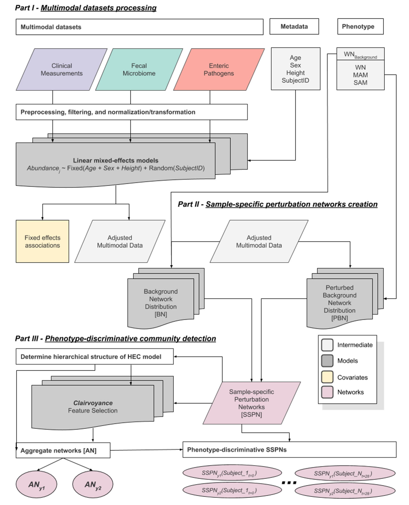

### Interactions between fecal gut microbiome, enteric pathogens, and energy regulating hormones among acutely malnourished rural Gambian children 

#### Abstract:
The specific roles that gut microbiota, known pathogens, and host energy-regulating hormones play in the pathogenesis of non-oedematous severe and moderate acute malnutrition (marasmus SAM) during outpatient nutritional rehabilitation are yet to be explored.  We applied an ensemble of sample-specific (intra- and inter-modality) association networks to gain deeper insights into the pathogenesis of acute malnutrition and its severity among children under 5 years of age in rural Gambia, where marasmus SAM is most prevalent. Children with marasmus SAM have distinct microbiome characteristics and biologically-relevant multimodal biomarkers not observed among children with moderate acute malnutrition. Marasmus SAM was characterized by lower microbial richness and biomass, significant enrichments in Enterobacteriaceae, altered interactions between specific Enterobacteriaceae and key energy regulating hormones and their receptors. Our findings suggest that marasmus SAM is characterized by the collapse of a complex system with nested interactions and key associations between the gut microbiome, enteric pathogens, and energy regulating hormones.  Further exploration of these systems will help inform innovative preventive and therapeutic interventions. 

* Citation:
   * Nabwera, HM+, Espinoza, JL+, Worwui A, Betts, M, Okoi C, Sesay AK., Bancroft W, Agbla SC., Jarju S, Bradbury RS., Colley M, Jallow AT, Liu J, Houpt ER., Prentice AM, Antonio M, Bernstein RM., Dupont CL.+, Kwambana-Adams BA.+ *Interactions between fecal gut microbiome, enteric pathogens, and energy regulating hormones among acutely malnourished rural Gambian children.* EBioMedicine. [doi:10.1016/j.ebiom.2021.103644](https://doi.org/10.1016/j.ebiom.2021.103644).

* BioProject: 
	* [PRJNA727842](https://www.ncbi.nlm.nih.gov/bioproject/?term=PRJNA727842)
* SRA (Fastq): 
	* [16S rRNA Amplicon Metagenomics](16S-rRNA_amplicon_SRA_Accession.list)
* FigShare: 
	* [Metadata, datasets, and networks for Nabwera-Espinoza et al. 2021](https://doi.org/10.6084/m9.figshare.16733584)

